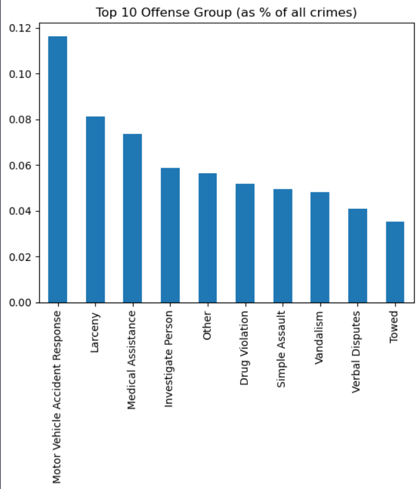

# EDA_Crime_Data_Analysis

## Introduction
In this project, it focuses on the process of **Exploratory Data Analysis (EDA)** from a CSV file called 
*crime.csv*. This project is guided by a YouTube Channel: [Mo Chen, Exploratory Data Analysis with Python](https://www.youtube.com/watch?v=hA0qyW-w3pQ&t=29s&ab_channel=MoChen), 
for better understanding in EDA process and best practice for beginner level.

## Tech Stack
1. Visual Studio Code
2. Jupyter Notebook
3. Python (NumPy, Pandas, Matplotlib, Seaborn, & Aliases) 

## Features
This project shows the EDA process of exploring the dataset of the crime dataFrame. 
It contains the basic information of our dataFrame such as data column information, 
data types for each column, statistical analysis for each column, and checking for missing and duplicated
values. After looking at some information of our analysis, we wanted to answer some questions about the 
dataset and creating data visuals of our findings.

## Process
Before I started working on this project, I want to find a video to guide me through this 
project to develop skills for EDA process and analyitical skills. When start working on this project, we 
had a problem grabbing data from the crime.csv, so we needed to import *aliases* library to list all encoding,
so we can access the dataset. After we were able to access our dataset we need, we start looking at the dataset and grab 
some basic information. Then, we start asking some questions about the dataset, so we start making queries to filter out 
our data to create our data visuals. 

## Improvement
I need to improve my queries skills when trying to filter a dataset, but the guide, Mo Chen, was kind 
enought to give us questions to answer, and provided solution to those problems. 

## Running the project
You can download the *crime.ipynb* file, and run it on either Jupyter Notebook, Visual Studio
Code (require Jupyter Notebook extension), and Google Colab. 

